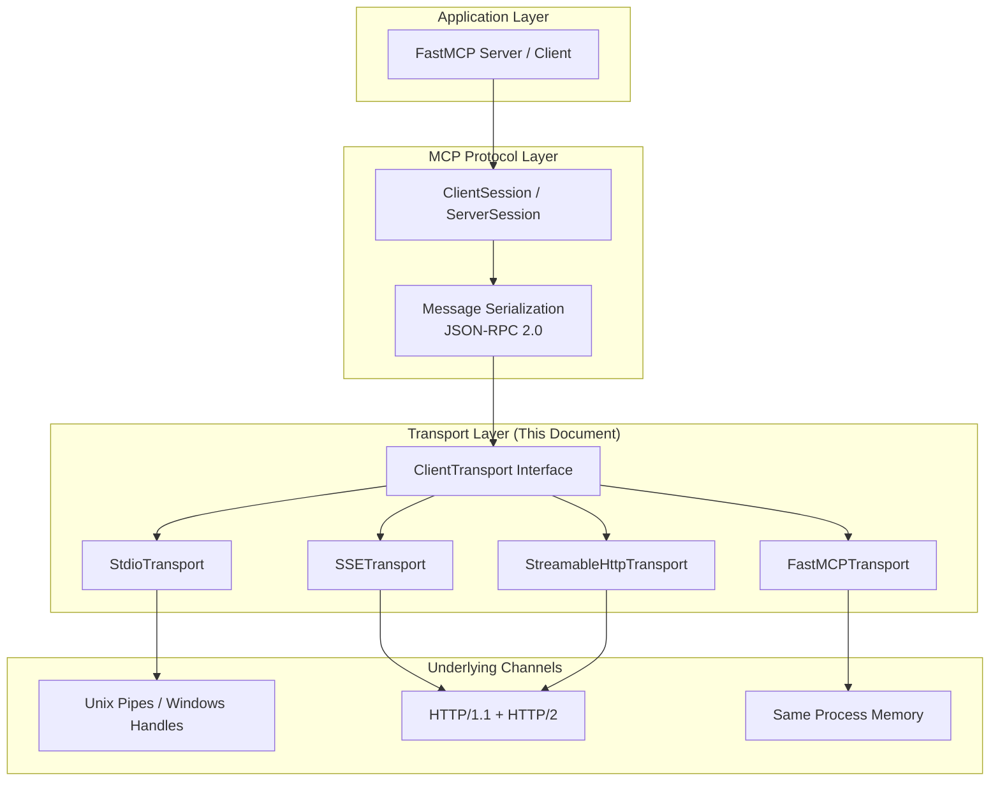
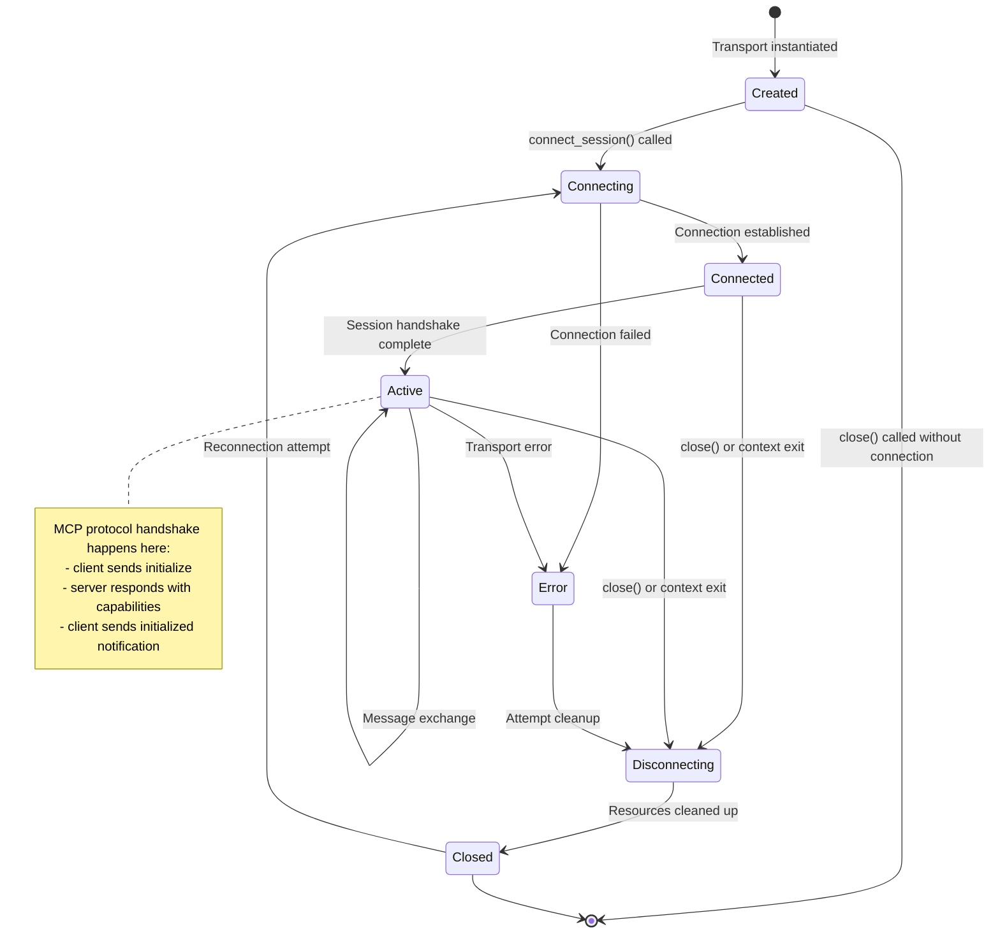
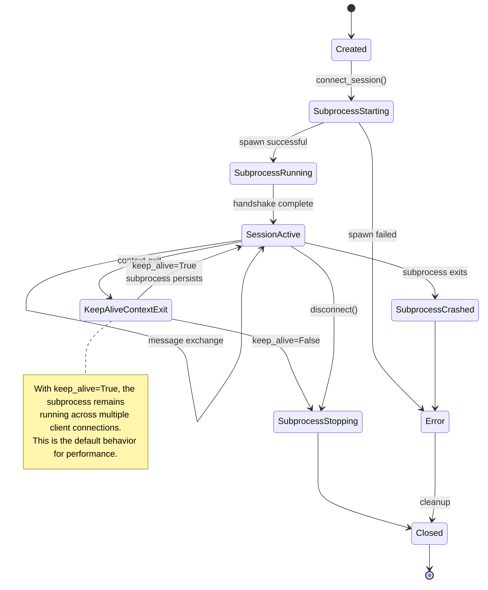

# Transport Layer Architecture

This document describes the FastMCP transport layer in depth. It is intended for:
- Advanced users who want to understand how transports work under the hood
- Extension developers who want to implement custom transports

For improvement suggestions identified during documentation writing, see [Architecture TODOs](./TODO).

---

## Overview

The transport layer sits between the MCP protocol layer and the underlying communication channel. It abstracts the differences between various transport mechanisms (stdio, HTTP, SSE, WebSocket, etc.) so the rest of the system can work with a consistent interface.

### Layered Architecture

<!-- Diagram: if mermaid doesn't render, see ASCII below -->


**ASCII Fallback:**
```
                    ┌──────────────────────────────────────────────────────┐
                    │              Application Layer                         │
                    │            FastMCP Server / Client                    │
                    └──────────────────────────┬───────────────────────────┘
                                               │
                    ┌──────────────────────────▼───────────────────────────┐
                    │              MCP Protocol Layer                        │
                    │  ClientSession / ServerSession + JSON-RPC 2.0        │
                    └──────────────────────────┬───────────────────────────┘
                                               │
                    ┌──────────────────────────▼───────────────────────────┐
                    │              Transport Layer (This Document)           │
                    │  ┌─────────────────────────────────────────────────┐  │
                    │  │           ClientTransport Interface               │  │
                    │  └───────────────────────────┬─────────────────────┘  │
                    │                              │                          │
                    │         ┌─────────┬──────────┼──────────┬─────────┐  │
                    │         │         │          │          │         │  │
                    │    ┌────┴────┐ ┌──┴───┐ ┌──┴───┐ ┌────┴────┐  │  │
                    │    │ Stdio   │ │ SSE  │ │HTTP  │ │ In-Mem  │  │  │
                    │    │Transport│ │Transp │ │Transp│ │Transport│  │  │
                    │    └────┬────┘ └──┬───┘ └──┬───┘ └────┬────┘  │  │
                    └─────────┼──────────┼────────┼──────────┼───────┘
                              │          │        │          │
                    ┌─────────▼──────────▼────────▼──────────▼───────┐
                    │              Underlying Channels                    │
                    │    ┌──────────┐  ┌──────────┐  ┌──────────────┐ │
                    │    │ OS Pipes │  │ HTTP/1.1 │  │ Same Process │ │
                    │    │ Handles  │  │ HTTP/2   │  │    Memory    │ │
                    │    └──────────┘  └──────────┘  └──────────────┘ │
                    └─────────────────────────────────────────────────────┘
```

### Key Relationships

| Component | Responsibility | File Location |
|-----------|----------------|---------------|
| `ClientTransport` | Abstract interface for all transports | `src/fastmcp/client/transports/base.py:36` |
| `ClientSession` | Protocol-level session management | MCP SDK |
| `Client` | High-level client API | `src/fastmcp/client/client.py:133` |

### Transport vs Protocol: A Clear Boundary

The transport layer is **only** responsible for:
- Establishing and tearing down connections
- Delivering byte streams or messages reliably
- Connection lifecycle management
- Authentication (for HTTP-based transports)

The transport layer is **NOT** responsible for:
- Parsing JSON-RPC messages
- Request/response correlation
- Protocol-level error handling
- Tool/resource/prompt logic

**Code Reference:** The separation is visible in how transports work. A transport yields a `ClientSession`, and the session handles protocol logic:

```python
# Transport layer: provides read/write streams
async with sse_client(self.url, ...) as transport:
    read_stream, write_stream = transport
    
    # Protocol layer: ClientSession uses the streams
    async with ClientSession(read_stream, write_stream, ...) as session:
        yield session
```
*Source: `src/fastmcp/client/transports/sse.py:150-155`*

---

## Built-in Transport Comparison

FastMCP provides several built-in transports optimized for different use cases.

### Comparison Table

| Transport | Direction | Streaming | Concurrency Model | Typical Latency | Primary Use Case |
|-----------|-----------|-----------|-------------------|-----------------|------------------|
| **Stdio** | Full-duplex | Yes | Single connection, sequential | < 1ms | Local development, CLI tools, MCP standard |
| **SSE** | Half-duplex (server → client push, client → POST) | Yes | Long-poll connection, one message per POST | 50-200ms | Legacy HTTP, server-to-client push |
| **Streamable HTTP** | Full-duplex over HTTP | Yes | Session-aware, bidirectional over POST + GET | 20-100ms | **MCP Recommended**, production deployments |
| **In-Memory** | Full-duplex | Yes | Direct function calls | < 0.1ms | Unit testing, same-process communication |
| **MCP Config** | Multi-transport | Yes | Composite of above | Varies | Multi-server orchestration |
| **WebSocket** | Full-duplex (Planned) | Yes | Real bidirectional, low overhead | 5-50ms | AI chatbots, real-time interactions |

### Detailed Transport Descriptions

#### 1. Stdio Transport

Stdio is the MCP standard transport for local communication. It communicates with an MCP server through subprocess stdin/stdout pipes.

**Key Characteristics:**
- Fastest transport for local scenarios (no network overhead)
- Full-duplex communication through pipes
- Simple lifecycle management (subprocess == connection)
- Session persistence across multiple connections via `keep_alive=True`

**Code Example:**

```python
from fastmcp.client.transports import StdioTransport

transport = StdioTransport(
    command="python",
    args=["my_server.py"],
    env={"API_KEY": "secret"},
    cwd="/path/to/server",
    keep_alive=True  # Reuse subprocess across connections
)
```
*Source: `src/fastmcp/client/transports/stdio.py:22-173`*

**Server-side Usage:**

```python
from fastmcp import FastMCP

mcp = FastMCP("MyServer")

# Run with stdio transport
mcp.run(transport="stdio")
```
*Source: `src/fastmcp/server/mixins/transport.py:184-224`*

#### 2. SSE Transport (Legacy)

Server-Sent Events provides HTTP-based server-to-client push with client-to-server communication via separate POST requests.

**Key Characteristics:**
- Server can push messages to client at any time
- Client sends requests via separate HTTP POST
- Not full-duplex (requires two separate HTTP channels)
- Maintained for backward compatibility

**Code Example:**

```python
from fastmcp.client.transports import SSETransport

transport = SSETransport(
    url="https://api.example.com/sse",
    headers={"Authorization": "Bearer token"},
    verify=False  # For self-signed certs in development
)
```
*Source: `src/fastmcp/client/transports/sse.py:25-158`*

#### 3. Streamable HTTP Transport (Recommended)

Streamable HTTP is the MCP-recommended HTTP transport. It combines the best of SSE with proper bidirectional session management.

**Key Characteristics:**
- **MCP official recommendation** for HTTP-based deployments
- Full session awareness via session ID
- Supports stateless mode for horizontal scaling
- Built-in event store for resumable connections
- Supports SSL verification configuration

**Code Example:**

```python
from fastmcp.client.transports import StreamableHttpTransport

transport = StreamableHttpTransport(
    url="https://api.example.com/mcp",
    headers={"X-Custom-Header": "value"},
    auth="oauth",  # Automatic OAuth flow
    verify="/path/to/ca-bundle.pem"  # Custom SSL verification
)
```
*Source: `src/fastmcp/client/transports/http.py:27-220`*

**Server-side with Event Store:**

```python
from fastmcp import FastMCP
from mcp.server.streamable_http import EventStore

mcp = FastMCP("ProductionServer")

# Enable resumable connections with event store
app = mcp.http_app(
    transport="streamable-http",
    event_store=EventStore(),  # Enables reconnection with resume
    retry_interval=3000,  # Client retry hint in ms
    stateless_http=False  # Set True for horizontal scaling
)
```
*Source: `src/fastmcp/server/mixins/transport.py:307-369`*

#### 4. In-Memory Transport

In-memory transport connects directly to a FastMCP server instance within the same Python process.

**Key Characteristics:**
- Zero network overhead
- No subprocess management
- Ideal for unit testing
- Server and client share the same memory space

**Code Example:**

```python
from fastmcp import FastMCP, Client

mcp = FastMCP("TestServer")

@mcp.tool
def add(a: int, b: int) -> int:
    return a + b

# Client connects directly, no network
client = Client(mcp)

async with client:
    result = await client.call_tool("add", {"a": 1, "b": 2})
```
*Source: `src/fastmcp/client/transports/memory.py:14-86`*

**Critical Context Manager Nesting:**

The in-memory transport requires precise context manager ordering to prevent deadlocks during teardown:

```python
# CORRECT: lifespan OUTER, task group INNER
async with _enter_server_lifespan(server=self.server):
    async with anyio.create_task_group() as tg:
        tg.start_soon(lambda: self.server._mcp_server.run(...))
        async with ClientSession(...) as client_session:
            yield client_session
```
*Source: `src/fastmcp/client/transports/memory.py:57-78`*

**Why this matters:** If reversed, the Docket Worker shutdown would hang for 5 seconds because fakeredis blocking operations held by pub/sub subscriptions prevent clean cancellation. See `tests/client/transports/test_memory_transport.py:15-56` for the regression test.

#### 5. MCP Config Transport

MCP Config transport provides a unified interface to multiple MCP servers defined in an MCPConfig.

**Key Characteristics:**
- Single client interface to multiple servers
- Automatic transport inference based on config
- Tool namespacing: `{server_name}_{tool_name}`
- Resource URI patterns: `protocol://{server_name}/path`

**Code Example:**

```python
from fastmcp import Client

config = {
    "mcpServers": {
        "weather": {
            "url": "https://weather.example.com/mcp",
            "transport": "http"
        },
        "assistant": {
            "command": "python",
            "args": ["./assistant.py"],
            "env": {"LOG_LEVEL": "INFO"}
        }
    }
}

client = Client(config)

async with client:
    # Tools are namespaced by server
    weather = await client.call_tool("weather_get_forecast", {"city": "NYC"})
    answer = await client.call_tool("assistant_ask", {"question": "What?"})
```
*Source: `src/fastmcp/client/transports/config.py:25-210`*

---

## Transport Interface Contract

To implement a custom transport, you must extend `ClientTransport` and implement the required methods.

### Abstract Base Class

```python
class ClientTransport(abc.ABC):
    """Abstract base class for different MCP client transport mechanisms."""

    @abc.abstractmethod
    @contextlib.asynccontextmanager
    async def connect_session(
        self, **session_kwargs: Unpack[SessionKwargs]
    ) -> AsyncIterator[ClientSession]:
        """Establishes a connection and yields an active ClientSession."""
        raise NotImplementedError
        yield

    async def close(self):  # Optional override
        """Close the transport."""

    def get_session_id(self) -> str | None:  # Optional override
        """Get the session ID for this transport, if available."""
        return None

    def _set_auth(self, auth: ...):  # Optional override
        """Set authentication for the transport."""
        if auth is not None:
            raise ValueError("This transport does not support auth")
```
*Source: `src/fastmcp/client/transports/base.py:36-81`*

### Required Method: `connect_session()`

The core method that all transports must implement. It must:

1. Establish the underlying connection
2. Create read/write streams
3. Wrap them in a `ClientSession`
4. Yield the session within the context
5. Clean up resources on exit

**Implementation Pattern:**

```python
@contextlib.asynccontextmanager
async def connect_session(
    self, **session_kwargs: Unpack[SessionKwargs]
) -> AsyncIterator[ClientSession]:
    
    # 1. Set up transport-specific connection
    async with some_transport_connect(...) as (read_stream, write_stream):
        
        # 2. Create protocol session
        async with ClientSession(
            read_stream, 
            write_stream, 
            **session_kwargs
        ) as session:
            
            # 3. Yield to caller
            yield session
            
            # 4. Cleanup happens automatically via context managers
```

### Message Boundary and Ordering Guarantees

| Guarantee | Requirement |
|-----------|-------------|
| **Message Order** | Messages must be delivered in the same order they were sent |
| **Message Boundaries** | Each MCP JSON-RPC message must be delivered as a complete unit |
| **At Least Once** | Messages should not be silently dropped |
| **No Duplicates** | Ideally, but protocol layer handles duplicate detection |

### Backpressure Handling

Transports must handle backpressure appropriately:

1. **Stdio**: Backpressure is handled by the OS pipe buffers
2. **HTTP/SSE**: Backpressure through HTTP flow control and TCP
3. **In-Memory**: Backpressure through async queue capacity

**Implementation Note:** Transports should not silently drop messages when buffers are full. They should either block (with timeouts) or propagate errors.

### SessionKwargs Reference

When implementing `connect_session()`, these are the possible session kwargs:

```python
class SessionKwargs(TypedDict, total=False):
    """Keyword arguments for the MCP ClientSession constructor."""
    read_timeout_seconds: datetime.timedelta | None
    sampling_callback: SamplingFnT | None
    sampling_capabilities: mcp.types.SamplingCapability | None
    list_roots_callback: ListRootsFnT | None
    logging_callback: LoggingFnT | None
    elicitation_callback: ElicitationFnT | None
    message_handler: MessageHandlerFnT | None
    client_info: mcp.types.Implementation | None
```
*Source: `src/fastmcp/client/transports/base.py:23-33`*

---

## Transport Lifecycle

All transports follow a consistent lifecycle, though the exact mechanics vary by transport type.

### State Diagram

<!-- Diagram: if mermaid doesn't render, see ASCII below -->


**ASCII Fallback:**
```
     ┌────────────────────────────────────────────────────────────────┐
     │                        Transport Lifecycle                        │
     └────────────────────────────────────────────────────────────────┘

  [*]
   │
   ▼
┌─────────┐     close() without connect
│ Created │ ──────────────────────────────────▶ [*]
└────┬────┘
     │ connect_session() called
     ▼
┌────────────┐     Connection failed
│ Connecting │ ─────────────────────────▶ ┌─────────┐
└──────┬─────┘                              │  Error  │
       │ Connection established              └────┬────┘
       ▼                                          │
┌───────────┐                                     │ Attempt cleanup
│ Connected │                                     ▼
└─────┬─────┘                            ┌──────────────┐
      │ Session handshake complete        │ Disconnecting │
      ▼                                  └───────┬──────┘
┌──────────┐                                      │ Resources cleaned up
│  Active  │◀────── Message exchange            ▼
└────┬─────┘                                ┌─────────┐
     │                                      │ Closed  │ ───▶ [*]
     ├────── close() or context exit        └────┬────┘
     │                                            │
     ▼                                            │ Reconnection
┌──────────────┐                                  │      attempt
│ Disconnecting │◀─────────────────────────────────┘      │
└──────────────┘                                            ▼
      │                                              ┌────────────┐
      │                                              │ Connecting │
      ▼                                              └────────────┘
   [*]

Note: In Active state, MCP protocol handshake occurs:
  1. Client sends "initialize"
  2. Server responds with capabilities
  3. Client sends "initialized" notification
```

### Lifecycle States Explained

| State | Description | Actions Possible |
|-------|-------------|------------------|
| **Created** | Transport object exists but no connection | Instantiate, configure |
| **Connecting** | Establishing underlying channel | Wait for completion |
| **Connected** | Channel established, session being created | None yet |
| **Active** | Full MCP session ready | Send/receive messages |
| **Disconnecting** | Clean shutdown in progress | Wait for completion |
| **Error** | Unrecoverable error occurred | Log, attempt cleanup |
| **Closed** | All resources released | Reconnect (some transports) |

### Stdio-specific Lifecycle

Stdio has additional complexity due to subprocess management and `keep_alive`:

<!-- Diagram: if mermaid doesn't render, see ASCII below -->


**ASCII Fallback:**
```
     ┌────────────────────────────────────────────────────────────────┐
     │                    Stdio Transport Lifecycle                     │
     │              (with keep_alive subprocess management)             │
     └────────────────────────────────────────────────────────────────┘

  [*]
   │
   ▼
┌─────────┐
│ Created │
└────┬────┘
     │ connect_session()
     ▼
┌──────────────────┐     spawn failed
│SubprocessStarting│ ─────────────────────▶ ┌─────────┐
└────────┬─────────┘                          │  Error  │
         │ spawn successful                   └────┬────┘
         ▼                                          │
┌──────────────────┐                                │ cleanup
│ SubprocessRunning │                                ▼
└────────┬─────────┘                          ┌─────────┐
         │ handshake complete                 │ Closed  │ ───▶ [*]
         ▼                                    └─────────┘
┌──────────────────┐
│  SessionActive   │◀──── message exchange
└────────┬─────────┘
         │
    ┌────┴─────────────────────────┐
    │                               │
    │ context exit                  │ disconnect()
    ▼                               ▼
┌────────────────────┐        ┌──────────────────┐
│KeepAliveContextExit│        │ SubprocessStopping│
└─────────┬──────────┘        └────────┬─────────┘
          │                             │
    ┌─────┴──────────┐                  │
    │                │                  │
    │ keep_alive=True│ keep_alive=False │
    │                │                  │
    ▼                ▼                  ▼
┌────────────┐  ┌──────────────────┐  ┌─────────┐
│SessionActive│  │SubprocessStopping│  │ Closed  │
└────────────┘  └──────────────────┘  └─────────┘
     subprocess persists

Note: Default behavior is keep_alive=True for performance.
Set keep_alive=False if you need subprocess cleanup on
each context exit.
```

**Code Reference for keep_alive:**

```python
@contextlib.asynccontextmanager
async def connect_session(
    self, **session_kwargs: Unpack[SessionKwargs]
) -> AsyncIterator[ClientSession]:
    try:
        await self.connect(**session_kwargs)
        yield cast(ClientSession, self._session)
    finally:
        if not self.keep_alive:
            await self.disconnect()
        else:
            logger.debug("Stdio transport has keep_alive=True, not disconnecting")
```
*Source: `src/fastmcp/client/transports/stdio.py:71-83`*

### Streamable HTTP Lifecycle with Session ID

Streamable HTTP maintains session identity across requests:

```python
# StreamableHttpTransport tracks session ID
def get_session_id(self) -> str | None:
    if self._get_session_id_cb:
        try:
            return self._get_session_id_cb()
        except Exception:
            return None
    return None
```
*Source: `src/fastmcp/client/transports/http.py:207-213`*

---

## Error Semantics

Understanding the boundary between transport errors and protocol errors is critical.

### Error Type Boundary

| Error Type | Origin | Responsibility | Examples |
|------------|--------|-----------------|----------|
| **Transport Error** | Transport layer | Transport should raise or propagate | Connection refused, timeout, SSL error, subprocess exit |
| **Protocol Error** | Protocol layer | ClientSession handles | Invalid JSON-RPC, method not found, invalid params |

### Transport Error Code Reference

FastMCP provides a structured exception hierarchy for transport errors. All transport errors inherit from `MCPTransportError`.

#### JSON-RPC Error Code Ranges

Per JSON-RPC 2.0 spec:
- `-32700`: Parse error
- `-32600`: Invalid Request
- `-32601`: Method not found
- `-32602`: Invalid params
- `-32603`: Internal error
- `-32000 to -32099`: Server error (implementation-defined)

**Key Distinction:**
- **-32000**: Generic server/transport error (multiple subclasses use this)
- **-32001**: Tool not found (**NOT** a transport error)
- **-32002**: Resource not found (**NOT** a transport error)

When debugging:
- If you see `-32000`, check the exception class name (`MCPTransportError`, `MCPConnectionError`, `MCPTimeoutError`, etc.)
- If you see `-32001`, it's a tool lookup issue
- If you see `-32002`, it's a resource lookup issue

#### Transport Error Code Table

| Code | Exception Class | Meaning | Typical Scenarios | How to Handle |
|------|-----------------|---------|-------------------|---------------|
| **-32000** | `MCPTransportError` | Base transport error | Generic transport layer failure | Catch this to handle all transport errors |
| **-32000** | `MCPConnectionError` | Connection failure | Connection refused, network unreachable | Retry with backoff, check network |
| **-32000** | `MCPTimeoutError` | Operation timeout | Slow network, overloaded server | Retry with longer timeout, check server load |
| **-32000** | `MCPDisconnectedError` | Unexpected disconnection | Server crashed, connection dropped | Attempt reconnection, notify user |
| **-32603** | `MCPInternalError` | Internal server error | Bug in server code | Report bug, don't retry unless transient |

**Inheritance Hierarchy:**
```
FastMCPError (code: -32603)
├── MCPProtocolError (code: -32600)
│   ├── MCPParseError (code: -32700)
│   ├── MCPInvalidRequestError (code: -32600)
│   └── MCPMethodNotFoundError (code: -32601)
├── MCPTransportError (code: -32000)  ← Transport layer base
│   ├── MCPConnectionError (code: -32000)
│   ├── MCPTimeoutError (code: -32000)
│   └── MCPDisconnectedError (code: -32000)
├── MCPToolError (code: -32603)
│   ├── ToolNotFoundError (code: -32001)  ← NOT transport!
│   └── ...
└── MCPResourceError (code: -32603)
    ├── ResourceNotFoundError (code: -32002)  ← NOT transport!
    └── ...
```
*Source: `src/fastmcp/exceptions.py:1-468`*

### Transport Error Categories

#### 1. Connection Errors

Errors occurring during connection establishment:

```python
# Examples of connection errors
ConnectionRefusedError: "Connection refused"
TimeoutError: "Connection timed out"
ssl.SSLError: "SSL certificate verify failed"
OSError: "Network is unreachable"
```

**Handling:** Transports should let these propagate. Callers can decide whether to retry.

#### 2. Mid-connection Errors

Errors occurring after successful connection:

```python
# Stdio: subprocess exits unexpectedly
def _is_session_dead(self) -> bool:
    if self._session is None:
        return False
    try:
        if self._session._write_stream.statistics().open_send_streams == 0:
            return True
        return self._session._read_stream.statistics().open_send_streams == 0
    except AttributeError:
        return False
```
*Source: `src/fastmcp/client/transports/stdio.py:144-160`*

#### 3. Authentication Errors

HTTP-based transports can encounter auth errors:

```python
# Transport wraps auth but doesn't interpret errors
def _set_auth(self, auth: ...):
    if auth == "oauth":
        resolved = OAuth(self.url, ...)
    elif isinstance(auth, str):
        resolved = BearerAuth(auth)
    # ...
    self.auth = resolved
```
*Source: `src/fastmcp/client/transports/http.py:101-122`*

**Auth errors** (401, 403) should propagate as `httpx.HTTPStatusError` so the OAuth handler can attempt token refresh.

### When to Retry vs When to Fail

| Scenario | Recommended Action | Rationale |
|----------|-------------------|-----------|
| Connection refused on first attempt | Retry with backoff | Service might be starting |
| Connection refused after multiple retries | Fail | Service likely down |
| Network timeout | Retry with longer timeout | Temporary network issue |
| SSL certificate error | Fail | Security violation |
| Authentication error (401) | Retry with token refresh | Token might be expired |
| Authentication error (403) | Fail | Insufficient permissions |
| Subprocess crash | Fail (or restart) | State may be corrupted |

**Note:** The transport layer itself does NOT implement retry logic. Retry is the responsibility of the caller or a higher-level wrapper.

---

## Transport Selection Guide

### Decision Tree

```
                    ┌─────────────────────────────────────┐
                    │  Where does your server run?        │
                    └─────────────────────────────────────┘
                                    │
            ┌───────────────────────┼───────────────────────┐
            │                       │                       │
            ▼                       ▼                       ▼
    ┌───────────────┐      ┌───────────────┐      ┌─────────────────┐
    │ Same machine  │      │ Same process  │      │ Different       │
    │ (subprocess)  │      │               │      │ machine (HTTP)  │
    └───────────────┘      └───────────────┘      └─────────────────┘
            │                       │                       │
            ▼                       ▼                       ▼
    ┌───────────────┐      ┌───────────────┐      ┌─────────────────┐
    │ StdioTransport│      │ FastMCPTransport│    │ Need HTTP-based │
    │               │      │               │      │                 │
    │ - MCP standard│      │ - Fastest     │      │   ┌───────────┐ │
    │ - CLI tools   │      │ - Unit tests  │      │   │ Latency   │ │
    │ - Local dev   │      │ - Same-process│      │   │ Critical? │ │
    └───────────────┘      └───────────────┘      │   └─────┬─────┘ │
                                                   │         │       │
                                                   │    ┌────┴────┐  │
                                                   │    │ Yes     │  │
                                                   │    ▼         ▼  │
                                                   │ ┌────────┐ ┌───┐│
                                                   │ │WebSocket│ │HTTP││
                                                   │ │(Planned)│ │   ││
                                                   │ └────────┘ └───┘│
                                                   │  Real-time  MCP rec│
                                                   └─────────────────┘
```

### FAQ: Which Transport Should I Use?

#### Q1: "I'm building an MCP server for local CLI usage. Which transport?"

**A: Use StdioTransport (or let the client auto-infer).**

Stdio is the MCP standard for local communication. All MCP clients (Claude Desktop, Cursor, etc.) expect stdio as the default.

```python
# Server
from fastmcp import FastMCP
mcp = FastMCP("LocalServer")
mcp.run(transport="stdio")  # Default

# Client
from fastmcp import Client
client = Client("my_server.py")  # Auto-infers stdio
```

#### Q2: "I'm deploying my MCP server to production. Which transport?"

**A: Use StreamableHttpTransport.**

Streamable HTTP is the MCP-recommended HTTP transport. It supports:
- Session persistence
- Resumable connections (with EventStore)
- Stateless mode for horizontal scaling
- OAuth and Bearer token authentication

```python
# Server
from fastmcp import FastMCP
from mcp.server.streamable_http import EventStore

mcp = FastMCP("ProductionServer")
app = mcp.http_app(
    transport="streamable-http",  # Default for HTTP
    event_store=EventStore(),  # Enable resumable connections
)

# Client
from fastmcp import Client
client = Client("https://api.example.com/mcp", auth="oauth")
```

#### Q3: "I'm writing unit tests for my MCP server. Which transport?"

**A: Use FastMCPTransport (in-memory).**

In-memory transport is the fastest and simplest for testing. No subprocess management, no network overhead.

```python
import pytest
from fastmcp import FastMCP, Client

@pytest.mark.asyncio
async def test_my_tool():
    mcp = FastMCP("TestServer")
    
    @mcp.tool
    def greet(name: str) -> str:
        return f"Hello, {name}!"
    
    # Direct in-memory connection
    async with Client(mcp) as client:
        result = await client.call_tool("greet", {"name": "World"})
        assert result.data == "Hello, World!"
```

#### Q4: "I need to connect to multiple MCP servers from one client. Which transport?"

**A: Use MCPConfigTransport.**

MCPConfigTransport lets you define multiple servers in a single config and access them through a unified client interface.

```python
config = {
    "mcpServers": {
        "filesystem": {
            "command": "npx",
            "args": ["@modelcontextprotocol/server-filesystem", "/home/user"]
        },
        "weather": {
            "url": "https://weather-api.example.com/mcp"
        }
    }
}

client = Client(config)

async with client:
    # Tools are automatically namespaced
    files = await client.call_tool("filesystem_list", {"path": "/"})
    forecast = await client.call_tool("weather_get_forecast", {"city": "London"})
```

#### Q5: "I have an existing MCP server that uses SSE. Should I migrate?"

**A: Yes, migrate to Streamable HTTP if possible.**

SSE is maintained for backward compatibility but Streamable HTTP is the MCP recommendation. Benefits:
- Proper session management
- Better error handling
- Stateless mode support
- Event store for resumability

**Migration path:**

```python
# BEFORE (SSE)
from fastmcp.client.transports import SSETransport
transport = SSETransport(url="https://api.example.com/sse")

# AFTER (Streamable HTTP)
from fastmcp.client.transports import StreamableHttpTransport
transport = StreamableHttpTransport(url="https://api.example.com/mcp")
```

Note: Your server endpoint may need to change. Check your server's HTTP path configuration.

---

### Industrial Scenario FAQ

#### Q6: "Building an AI Chatbot. Should I use WebSocket, SSE, or HTTP Stream?"

**A: Short answer: Use WebSocket (once available) or Streamable HTTP.**

| Transport | Chatbot Readiness | Latency | Server Push | Complexity |
|-----------|-------------------|---------|-------------|------------|
| **WebSocket** | ⭐⭐⭐ Best (Planned) | 5-50ms | Native bidirectional | Medium |
| **Streamable HTTP** | ⭐⭐ Good (Current) | 20-100ms | Yes (via GET stream) | Low |
| **SSE** | ⭐⭐ Fair (Legacy) | 50-200ms | Yes | Low |
| **Stdio** | ⭐ Not for remote | <1ms | Yes | N/A (local only) |

**Recommendation by chatbot type:**

1. **Real-time conversational AI (low latency critical):**
   - **WebSocket** (when implemented) - native bidirectional, minimal overhead
   - Streamable HTTP with EventStore - current best option

2. **Document/knowledge base Q&A (latency tolerant):**
   - **Streamable HTTP** - MCP standard, production-ready
   - Built-in resumable connections for long-running tool calls

3. **Why NOT SSE for chatbots:**
   - Half-duplex: client sends via POST, receives via SSE
   - Higher latency due to HTTP handshake overhead per request
   - Not the MCP recommendation going forward

**Code Example for Streamable HTTP in Chatbot:**
```python
# Server - enable resumable connections for interrupted tool calls
app = mcp.http_app(
    transport="streamable-http",
    event_store=EventStore(),  # Critical for resuming interrupted sessions
    retry_interval=2000,  # Aggressive retry for chat UX
)

# Client - configure for chat-like interaction
transport = StreamableHttpTransport(
    url="https://chat-api.example.com/mcp",
    auth="oauth",
    # Consider shorter timeouts with retry logic at application layer
)
```

#### Q7: "Planning for >1000 concurrent remote clients. Can stdio handle this?"

**A: NO. Stdio is for local subprocess communication only.**

| Transport | Scalability | Concurrency Model | Remote Clients |
|-----------|-------------|-------------------|----------------|
| **Stdio** | ❌ NO | One subprocess per client | ❌ Local only |
| **Streamable HTTP** | ✅ YES | Async I/O, can scale horizontally | ✅ Yes |
| **SSE** | ⚠️ Limited | Long-poll per connection | ✅ Yes |
| **WebSocket** | ✅ Excellent (Planned) | Native connection handling | ✅ Yes |

**Why stdio fails at scale:**

1. **Resource overhead:** Each client needs a separate subprocess
   - 1000 clients = 1000 Python processes
   - Memory: ~50-100MB per process = 50-100GB RAM
   - CPU context switching overhead becomes prohibitive

2. **No remote access:** Stdio communicates via OS pipes, not network sockets
   - Cannot access from different machines
   - Cannot load balance across servers

**Correct Architecture for High Concurrency:**

```python
# Server - Streamable HTTP with stateless mode for horizontal scaling
from fastmcp import FastMCP

mcp = FastMCP("HighConcurrencyServer")

app = mcp.http_app(
    transport="streamable-http",
    stateless_http=True,  # Critical for horizontal scaling
    # No event_store needed in stateless mode
)

# Deploy behind load balancer (Nginx, ALB, etc.)
# - Multiple server instances
# - Load balancer distributes requests
# - Stateless mode enables any server to handle any request
```

**Scaling Strategy:**

| Clients | Architecture |
|---------|--------------|
| < 100 | Single server instance, stateful mode |
| 100-1000 | Multiple servers behind load balancer, stateless mode |
| > 1000 | Auto-scaling group + stateless HTTP + shared state storage |

#### Q8: "Building a B2B product for enterprise clients. Recommend HTTP + mTLS combination?"

**A: YES. Streamable HTTP + mTLS is the industrial standard for B2B/enterprise.**

### Enterprise Security Architecture

```
┌─────────────────────────────────────────────────────────────────────┐
│                    Enterprise B2B Security Stack                      │
├─────────────────────────────────────────────────────────────────────┤
│                                                                      │
│  ┌──────────────┐         TLS Handshake         ┌──────────────┐   │
│  │   Client     │ ◀──────────────────────────▶  │ Load Balancer │   │
│  │  (Customer)  │   Mutual Authentication       │  (Reverse     │   │
│  │              │   - Client cert verified      │   Proxy)       │   │
│  │ Presents:    │   - Server cert verified     │  Terminates:   │   │
│  │  - API Key   │                              │   - TLS        │   │
│  │  - Client    │                              │   - mTLS       │   │
│  │    Cert      │                              │                │   │
│  └──────────────┘                              └────────┬───────┘   │
│                                                         │            │
│                                                         │ Internal   │
│                                                         │ HTTP       │
│                                                         ▼            │
│                                              ┌──────────────────┐    │
│                                              │ FastMCP Server   │    │
│                                              │                  │    │
│                                              │ Transport:       │    │
│                                              │   streamable-http│    │
│                                              │                  │    │
│                                              │ Auth Layers:     │    │
│                                              │ 1. mTLS (L4)     │    │
│                                              │ 2. OAuth/JWT (L7)│    │
│                                              │ 3. API Key (L7)  │    │
│                                              └──────────────────┘    │
└─────────────────────────────────────────────────────────────────────┘
```

### Recommended Configuration

**Server-side:**
```python
from fastmcp import FastMCP
from fastmcp.server.auth import BearerTokenAuth

mcp = FastMCP("EnterpriseServer")

# 1. Use Streamable HTTP (MCP standard)
app = mcp.http_app(
    transport="streamable-http",
    event_store=EventStore(),  # For resumable enterprise connections
    
    # 2. Application-level auth (layered security)
    auth=BearerTokenAuth(
        validate_token=validate_jwt_or_api_key
    ),
)

# 3. Deploy behind reverse proxy that terminates mTLS
#    - Nginx, Traefik, or cloud provider LB (AWS ALB, GCP LB)
#    - Client certificate verified at proxy level
#    - Proxy passes client identity via headers (X-Client-Cert-DN)
```

**Client-side:**
```python
from fastmcp import Client
from fastmcp.client.transports import StreamableHttpTransport
import ssl

# 1. Create SSL context for mTLS
context = ssl.create_default_context(
    cafile="/path/to/server-ca.pem"  # Verify server identity
)
context.load_cert_chain(
    certfile="/path/to/client-cert.pem",  # Client cert for mTLS
    keyfile="/path/to/client-key.pem"
)

# 2. Configure transport with mTLS + application auth
transport = StreamableHttpTransport(
    url="https://enterprise-api.example.com/mcp",
    
    # mTLS (transport layer)
    verify=context,  # Custom CA + client cert
    
    # Application layer auth (layered security)
    headers={
        "X-API-Key": "enterprise-client-api-key",
        # OR use auth="oauth" for token-based auth
    },
)

client = Client(transport)
```

### Enterprise Security Layers

| Layer | Technology | Purpose |
|-------|------------|---------|
| **L4: Transport** | mTLS | Mutual authentication, encryption in transit |
| **L7: Application** | OAuth 2.0 / JWT | Fine-grained authorization, token rotation |
| **L7: Application** | API Key | Simple machine-to-machine auth, rate limiting |
| **Network** | VPN / Private Link | Network isolation for sensitive environments |

**Why this combination:**
1. **mTLS** provides strong transport security (non-negotiable in enterprise)
2. **Streamable HTTP** is MCP-standard, well-supported, and production-ready
3. **Layered security** (mTLS + OAuth/API Key) provides defense in depth
4. **Load balancer termination** keeps cert management centralized

**Alternative for on-prem deployments:**
If WebSocket becomes available and your enterprise requires absolute minimal latency, WebSocket + mTLS is also a valid pattern. But for now, **Streamable HTTP + mTLS** is the most practical and standards-compliant choice.

---

## Implementing a Custom Transport

To implement a custom transport, follow this pattern:

### Required Steps

1. **Extend `ClientTransport`**
2. **Implement `connect_session()`** as an async context manager
3. **Override `close()` if you have resources to clean up**
4. **Override `get_session_id()` if your transport supports sessions**
5. **Override `_set_auth()` if your transport supports authentication**

### Template Implementation

```python
import contextlib
from collections.abc import AsyncIterator
from typing import Unpack

from mcp import ClientSession
from typing_extensions import Unpack

from fastmcp.client.transports.base import ClientTransport, SessionKwargs


class MyCustomTransport(ClientTransport):
    """
    Custom transport for [describe purpose].
    
    Explain when to use this transport and any special considerations.
    """
    
    def __init__(self, config: dict):
        # Initialize transport-specific state
        self.config = config
        self._connection = None
        self._session_id = None
    
    @contextlib.asynccontextmanager
    async def connect_session(
        self, **session_kwargs: Unpack[SessionKwargs]
    ) -> AsyncIterator[ClientSession]:
        """
        Establish connection and yield a ClientSession.
        
        This is the core method that must be implemented.
        """
        try:
            # 1. Establish your custom connection
            read_stream, write_stream = await self._establish_connection()
            
            # 2. Create and yield the ClientSession
            async with ClientSession(
                read_stream,
                write_stream,
                **session_kwargs
            ) as session:
                # 3. Store any session state if needed
                self._session_id = self._extract_session_id(session)
                
                # 4. Yield to caller
                yield session
                
        finally:
            # 5. Cleanup (if not handled by context managers above)
            await self._cleanup_connection()
    
    async def close(self):
        """Close the transport and release resources."""
        if self._connection:
            await self._connection.close()
            self._connection = None
    
    def get_session_id(self) -> str | None:
        """Return the current session ID, if available."""
        return self._session_id
    
    def _set_auth(self, auth):
        """Configure authentication for this transport."""
        # Implement if your transport supports auth
        # Raise ValueError if auth is not supported
        self.auth = self._resolve_auth(auth)
    
    # Transport-specific helper methods
    async def _establish_connection(self):
        # Your custom connection logic
        raise NotImplementedError
    
    async def _cleanup_connection(self):
        # Your custom cleanup logic
        pass
    
    def _extract_session_id(self, session):
        # Extract session ID if your protocol supports it
        return None
    
    def _resolve_auth(self, auth):
        # Resolve auth configuration
        return auth
```

### Key Requirements Checklist

| Requirement | Check |
|-------------|-------|
| `connect_session()` is an async context manager | ☐ |
| Yields a valid `ClientSession` | ☐ |
| All resources are cleaned up on exit (normal or error) | ☐ |
| `close()` handles idempotent calls (safe to call multiple times) | ☐ |
| Transport can be reconnected after `close()` | ☐ (if applicable) |
| `__repr__()` returns helpful representation | ☐ |

---

## Server-side Transports

Servers also support multiple transports. The server-side API is unified through `run()` and `run_async()`.

### Server Transport Selection

```python
from fastmcp import FastMCP

mcp = FastMCP("MyServer")

# Option 1: Synchronous run
mcp.run(transport="stdio")        # Stdio
mcp.run(transport="http")         # Streamable HTTP (default)
mcp.run(transport="streamable-http")  # Explicit streamable HTTP
mcp.run(transport="sse")          # SSE (legacy)

# Option 2: Async run
await mcp.run_async(transport="http", host="0.0.0.0", port=8000)

# Option 3: Get ASGI app for integration with FastAPI/Starlette
app = mcp.http_app(transport="streamable-http")
```
*Source: `src/fastmcp/server/mixins/transport.py:43-98`*

### HTTP Transport Options

When using HTTP-based transports on the server:

```python
app = mcp.http_app(
    transport="streamable-http",
    path="/mcp",                    # Custom endpoint path
    json_response=False,             # Use JSON-Lines for responses
    stateless_http=False,            # Set True for horizontal scaling
    event_store=EventStore(),        # Enable resumable connections
    retry_interval=3000,             # Client retry hint (ms)
    middleware=[...],                # ASGI middleware
    auth=my_auth_provider            # Authentication
)
```
*Source: `src/fastmcp/server/mixins/transport.py:307-369`*

### Stateless vs Stateful HTTP

| Mode | Use Case | Session Handling |
|------|----------|------------------|
| **Stateful (default)** | Single server deployments | Session tracked in memory |
| **Stateless** | Horizontal scaling, serverless | New session per request, no server-side state |

**Stateless mode restrictions:**
- No server-initiated notifications
- No progress updates
- No subscriptions
- SSE GET endpoint disabled (only POST/DELETE)

```python
# Stateless mode for Kubernetes/Horizontal scaling
app = mcp.http_app(
    transport="streamable-http",
    stateless_http=True
)
```

---

## References

### Core Files

| File | Description |
|------|-------------|
| `src/fastmcp/client/transports/base.py` | `ClientTransport` abstract base class |
| `src/fastmcp/client/transports/stdio.py` | Stdio transport implementation |
| `src/fastmcp/client/transports/http.py` | Streamable HTTP transport |
| `src/fastmcp/client/transports/sse.py` | SSE transport (legacy) |
| `src/fastmcp/client/transports/memory.py` | In-memory transport |
| `src/fastmcp/client/transports/config.py` | MCP Config multi-server transport |
| `src/fastmcp/client/transports/inference.py` | Transport type inference |
| `src/fastmcp/server/mixins/transport.py` | Server-side transport handling |
| `src/fastmcp/server/http.py` | HTTP/SSE ASGI app creation |
| `src/fastmcp/exceptions.py` | Exception hierarchy and error codes |

### Test Files

| File | Description |
|------|-------------|
| `tests/client/transports/test_memory_transport.py` | In-memory transport tests (teardown ordering) |
| `tests/client/transports/test_transports.py` | SSL verification and auth propagation tests |
| `tests/client/test_stdio.py` | Stdio transport tests |
| `tests/client/test_sse.py` | SSE transport tests |

### User Documentation

| File | Description |
|------|-------------|
| `docs/clients/transports.mdx` | User-focused transport guide |
| `docs/deployment/http.mdx` | HTTP deployment guide |

---

*This document is a technical reference. For usage examples and tutorials, see the main documentation at [gofastmcp.com](https://gofastmcp.com).*
