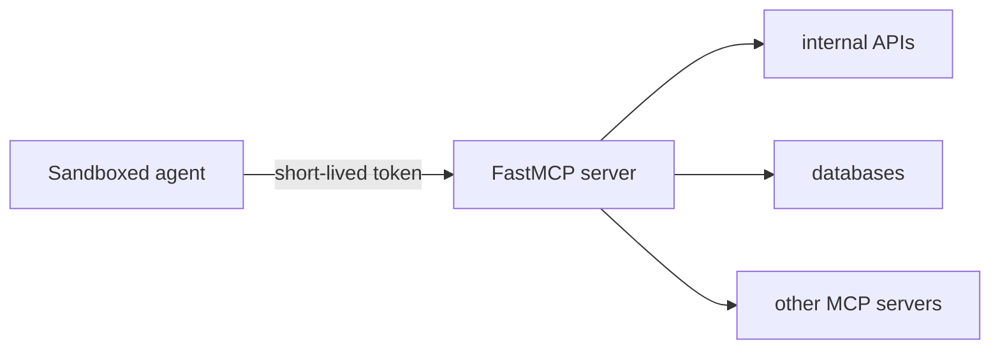

Building for sandboxed agents is different from building for a local desktop client. In a sandboxed setup, the container or subprocess running the agent is part of your trust boundary. Treat it like an untrusted worker: it should receive capabilities, not secrets.

This guide shows how to use FastMCP as that capability boundary. The recommended pattern is to deploy a remote FastMCP server, authenticate the sandbox with a short-lived token, and keep all privileged credentials on the server side.

## Why Sandboxed Agents Are Different

A desktop MCP client usually runs on a developer's machine and launches local servers with configuration the developer controls. A sandboxed agent is different:

- It often runs in an ephemeral container or subprocess.
- Its filesystem may be inspected after the fact.
- Its environment variables may be broader than you intend.
- You may launch many sandboxes concurrently for different users, tenants, or jobs.

That means convenience patterns that are acceptable locally become risky in sandboxes. Passing a GitHub token, database password, or cloud credentials directly into the sandbox creates a secret distribution problem you do not need to have.

The safer approach is to make your FastMCP server the only component with privileged access and let the sandbox call it over MCP.

## Recommended Architecture

Use this shape by default:



The sandbox gets:

- the MCP server URL
- a short-lived token scoped to its job, tenant, or run
- no long-lived upstream credentials

The FastMCP server does the privileged work:

- verifies the sandbox token
- resolves scope from token claims
- exposes only the tools that sandbox should see
- talks to internal APIs, databases, or upstream MCP servers on the sandbox's behalf

The key design rule is simple:

<Tip>
Give the sandbox capabilities, not credentials.
</Tip>

## Prefer HTTP for Sandboxed Agents

For sandboxes, prefer a remote HTTP server over a local STDIO server.

STDIO is still excellent for local development, but a remote HTTP server is usually the better production boundary for sandboxed agents because:

- authentication is explicit
- the server lifecycle is independent from the sandbox lifecycle
- secrets stay on the server
- one deployment can safely serve many sandboxes
- auditing and revocation happen in one place

This means the sandbox should connect as a client:

```python
from fastmcp import Client
from fastmcp.client.auth import BearerAuth

client = Client(
    "https://sandbox-tools.example.com/mcp",
    auth=BearerAuth("short-lived-sandbox-token"),
)
```

And your FastMCP server should run remotely:

```python
from fastmcp import FastMCP

mcp = FastMCP("Sandbox Tools")

if __name__ == "__main__":
    mcp.run(transport="http", host="0.0.0.0", port=8000)
```

For production transport setup, see [HTTP Deployment](/deployment/http).

## Authenticate the Sandbox, Not the Human

For sandboxed agents, it is often cleaner to authenticate the sandbox itself rather than trying to replay a full user login flow inside the container.

In practice, that usually means issuing a short-lived bearer token for each sandbox, run, or tenant and validating it on your FastMCP server with a token verifier.

```python
from fastmcp import FastMCP
from fastmcp.server.auth.providers.jwt import JWTVerifier

auth = JWTVerifier(
    jwks_uri="https://auth.example.com/.well-known/jwks.json",
    issuer="https://auth.example.com",
    audience="sandbox-mcp",
)

mcp = FastMCP("Sandbox Tools", auth=auth)
```

The token should identify the sandbox's scope, for example:

- sandbox or run id
- tenant or installation id
- expiration
- optional capability scopes

Avoid shared static tokens across many sandboxes. If one sandbox token leaks, you want the blast radius to be small and the lifetime to be short.

For validation patterns, see [Token Verification](/servers/auth/token-verification).

## Keep Secrets Out of the Sandbox

The sandbox should not need:

- GitHub app private keys
- database passwords
- upstream OAuth client secrets
- cloud provider credentials

Instead, expose narrow MCP tools that perform privileged work on the server side.

Good sandbox-facing tools tend to look like this:

- `get_recent_updates`
- `write_summary`
- `fetch_repo_context`
- `publish_review_comment`

These tools describe the capability the sandbox needs, not the low-level credentialed action required to perform it.

That distinction matters. A tool like `write_summary` lets the server decide where and how to persist the summary. A tool like `run_sql` or `call_internal_api` pushes privilege and policy into the sandbox where it is much harder to control.

## Keep Tools Narrow and Structured

Sandboxed agents behave best when tools are explicit and structured.

Prefer:

```python
from fastmcp import FastMCP

mcp = FastMCP("Sandbox Tools")

@mcp.tool
def write_summary(content: str) -> str:
    """Store the final summary for the current run."""
    ...
```

Over:

```python
@mcp.tool
def mutate_state(kind: str, payload: dict) -> dict:
    ...
```

Narrow tools are easier to audit, easier to authorize, and easier for agents to use reliably. They also let you express different policies per tool instead of creating one giant privileged escape hatch.

## Use a Proxy When Upstream Systems Are More Privileged

If the sandbox needs access to other MCP servers or internal systems, put FastMCP in front of them instead of forwarding secrets into the sandbox.

This is where proxying becomes useful. Your public-facing FastMCP server can authenticate the sandbox, then forward allowed capabilities to upstream systems with stronger credentials.

Typical examples:

- a sandbox-safe MCP gateway in front of internal MCP servers
- a FastMCP layer in front of internal HTTP APIs
- a job-scoped server that fronts a Git provider, issue tracker, or storage system

If the upstream system is itself an MCP server, FastMCP's proxy support is a natural fit. See [MCP Proxy](/servers/providers/proxy).

## mcp.json for Sandboxed Clients

If your sandboxed agent is configured through `mcp.json`, keep that configuration minimal. Point it at the remote FastMCP server and pass only the scoped values that sandbox needs.

```json
{
  "mcpServers": {
    "sandbox-tools": {
      "url": "https://sandbox-tools.example.com/mcp",
      "transport": "http"
    }
  }
}
```

If your client needs authentication, inject the short-lived token through the client's supported auth mechanism or environment handling. Avoid baking long-lived credentials directly into generated config files.

For configuration details, see [MCP.json](/integrations/mcp-json-configuration).

## Common Mistakes

The same few mistakes show up again and again in sandboxed deployments:

- passing long-lived API keys directly into the sandbox
- treating helper scripts in the sandbox as a security boundary
- exposing broad mutation tools instead of narrow capabilities
- using one shared token for every sandbox
- relying on STDIO inheritance for configuration in production

Each of these works at first. Each of them becomes painful once you have multiple tenants, multiple jobs, or an incident that requires revoking access quickly.

## Production Checklist

Before shipping a sandbox-facing FastMCP server, check these:

- The sandbox connects over HTTP, not with privileged local credentials.
- Tokens are short-lived and scoped to a run, tenant, or job.
- The FastMCP server verifies tokens on every request.
- Long-lived secrets stay on the server side.
- Tools are narrow, explicit, and structured.
- Upstream privileged systems sit behind the FastMCP server or proxy.
- Revocation and audit live at the server boundary, not inside the sandbox.

If you adopt those defaults, sandbox support stops being a special case and becomes a normal deployment pattern: isolated workers talk to a constrained FastMCP surface, and the server handles the privileged parts centrally.
