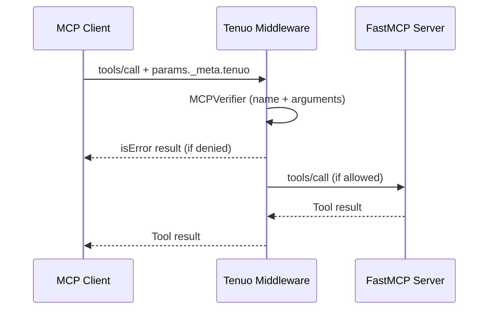

Add **per-call authorization** to FastMCP tools with [Tenuo][tenuo-github]. Each `tools/call` is checked at the **argument** level. Authority is traced across delegation chains. The server verifies **before the handler runs**.

Handlers stay ordinary `@mcp.tool()` functions. `TenuoMiddleware` is FastMCP [Middleware][fastmcp-middleware] that runs `MCPVerifier` on every `tools/call`.

## How it Works

Tenuo authorizes execution, not discovery. It does not filter `tools/list`.

1. The client puts a warrant and proof of possession on `params._meta.tenuo`.
2. `TenuoMiddleware` runs `MCPVerifier` on the tool name and arguments.
3. On allow, the middleware forwards `clean_arguments`, strips `tenuo` from `_meta`, and the handler runs. Handlers never see warrant material.
4. On deny, the middleware returns `isError=True` with structured `tenuo` diagnostics. The handler never runs.



The server trusts the issuer **public** key only (`Authorizer(trusted_roots=...)`). It never holds the issuer signing key.

## Add Authorization to Your Server

### Install

```bash
pip install "tenuo[fastmcp]"
```

This extra pins FastMCP 3.2.1 or later.

### Create a Server

```python server.py
import os

from fastmcp import FastMCP
from tenuo import Authorizer, PublicKey
from tenuo.mcp import MCPVerifier, TenuoMiddleware

authorizer = Authorizer(
    trusted_roots=[
        PublicKey.from_bytes(bytes.fromhex(os.environ["TENUO_ISSUER_PUB"]))
    ]
)
verifier = MCPVerifier(authorizer=authorizer, require_warrant=True)
mcp = FastMCP("infrastructure", middleware=[TenuoMiddleware(verifier)])


@mcp.tool()
async def scale_cluster(cluster: str, replicas: int) -> str:
    return f"Scaled {cluster} to {replicas}"


if __name__ == "__main__":
    mcp.run(transport="stdio")
```

You can also attach the middleware after construction with `mcp.add_middleware(TenuoMiddleware(verifier))`.

### Call It with a Warrant

```python agent.py
import asyncio
import sys

from tenuo import Capability, Pattern, Range, SigningKey, configure, mint
from tenuo.mcp import SecureMCPClient

issuer_key = SigningKey.generate()
configure(issuer_key=issuer_key, trusted_roots=[issuer_key.public_key])


async def main() -> None:
    async with SecureMCPClient(
        sys.executable,
        ["server.py"],
        inject_warrant=True,
        env={"TENUO_ISSUER_PUB": bytes(issuer_key.public_key_bytes()).hex()},
    ) as client:
        async with mint(
            Capability(
                "scale_cluster",
                cluster=Pattern("staging-*"),
                replicas=Range.max_value(10),
            )
        ):
            await client.tools["scale_cluster"](cluster="staging-web", replicas=3)


asyncio.run(main())
```

`SecureMCPClient(..., inject_warrant=True)` signs the call and places the envelope on `_meta.tenuo`. The same `_meta` shape works with the official MCP client if you attach it yourself.

## Denials

Failed checks never reach the handler. The middleware returns a tool error (`isError=True`) with structured `tenuo` diagnostics:

- `-32001` — denied (constraint, expired, missing warrant, bad signature)
- `-32002` — approval required

<Tip>
  For the full server and client walkthrough, see the [Tenuo MCP docs][tenuo-mcp-docs].
</Tip>

[tenuo-github]: https://github.com/tenuo-ai/tenuo
[tenuo-mcp-docs]: https://tenuo.ai/mcp
[fastmcp-middleware]: /servers/middleware
